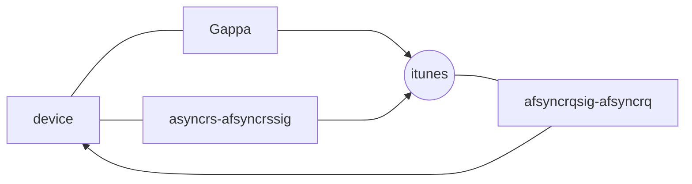

# APP
- https://init.itunes.apple.com/bag.xml?ix=6
- setting sync state for device 00008110-0000000000000010 to RequestingSync, previous state was Idle
progress> adjusting from
- sending RequestingSync for device 00008110-0000000000000010, dataclasses = { Media, Book, Keybag }, anchors = { Media = 5, VoiceMemo = 1 }
- waiting for ReadyForSync for device 00008110-0000000000000010
- got SyncAllowed message for device 00008110-0000000000000010
- got ReadyForSync message for device 00008110-0000000000000010
- got sync anchor 5 for dataclass Media, expected 5
- setting sync state for device 00008110-0000000000000010 to ReadyForSync, previous state was RequestingSync
- progress> adjusting from
- setting sync state for device 00008110-0000000000000010 to SyncingMetadata, previous state was ReadyForSync
- sending FinishedSyncingMetadata for device 00008110-0000000000000010, syncTypes = { Media = ATSyncDeltaSync, Book = ATSyncNoSync, Keybag = ATSyncDeltaSync }, anchors = { Media = 5, VoiceMemo = 1 }
- setting sync state for device 00008110-0000000000000010 to FinishedSyncingMetadata, previous state was SyncingMetadata
- waiting for AssetManifest or SyncFinished for device 00008110-0000000000000010, current state is FinishedSyncingMetadata
- got SyncFinished message for device 00008110-0000000000000010
- setting sync state for device 00008110-0000000000000010 to Finished, previous state was FinishedSyncingMetadata

# 用到的一些相关函数
- ATHRef (*ATHostConnectionCreateWithLibrary)(CFStringRef library, CFStringRef udid, int);
- void (*ATHostConnectionDestroy)(ATHRef);
- int (*ATHostConnectionSendPowerAssertion)(ATHRef, CFBooleanRef enable);
- void (*ATHostConnectionRetain)(ATHRef);
- void (*ATHostConnectionRelease)(ATHRef);
- CFDictionaryRef (*ATHostConnectionReadMessage)(ATHRef);
- int (*ATHostConnectionSendSyncRequest)(ATHRef, CFArrayRef, CFDictionaryRef, CFDictionaryRef);
- int (*ATHostConnectionSendPing)(ATHRef);
- void (*ATHostConnectionSendMessage)(ATHRef ath, CFDictionaryRef mATCFMessage);
- unsigned (*ATHostConnectionGetGrappaSessionId)(ATHRef);
- uint32_t (*ATHostConnectionGetCurrentSessionNumber)(ATHRef);
- int (*ATHostConnectionSendMetadataSyncFinished)(ATHRef, CFDictionaryRef, CFDictionaryRef);

# 核心函数
- typedef __int64 (*func_ImNUOAOCCj1zIAp6X14h)(uint32_t a1);
- typedef __int64 (*func_uhO2GULXwfgKwPcp4YR2)(__int64* a1, uint32_t *a2, __int64*_Nullable* _Nullable    a3, int* a4);
- typedef __int64 (*func_rpY4QOlsWsxk0fLzfV8h)(__int64* a1);
- typedef __int64 (*func_LainiFYJT9auDqhZYWzW)(uint32_t,__int64*,__int64);

# 流程

 
# 引用
- https://www.i4.cn/
- https://whaleapp.net
- https://bbs.kanxue.com/thread-229601.htm
- https://github.com/aidserv/aid
